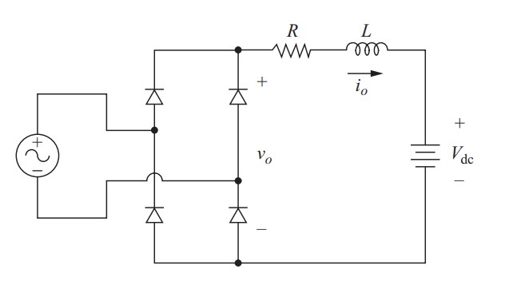

## Automatic Battery Charger using trickle charging arrangement
<h3>Battery Charger types</h3>

- Trickle Charger 
- Float Charger

<h3>Basics</h3>
<h4>Trickle Charger</h4>

- Simplest type of battery charger
- Charges the battery at its self-discharge rate by applying a constant voltage and current, regardless of whether the battery is fully charged.
- Manual turn on/off.
- Potentially damages battery when it is fully charged. 
 
<b>Trickle Charger Block Diagram</b> 

<h4>Float Charger</h4>

- In its simplest form, the float charger is a trickle charger with an automatic on/off switch
- This charger senses when the battery voltage reaches a preset reference level (VREF1) and turn off charging.
- Automatic turning off (VREF1) and turning on (VREF2) 
 
<b>Float Charger Block Diagram</b> 

