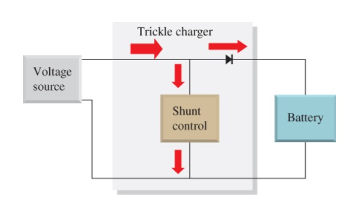
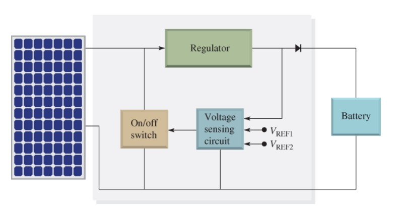

## Automatic Battery Charger using trickle charging arrangement
<h3>Battery Charger types</h3>

- Trickle Charger 
- Float Charger

<h3>Basics</h3>
<h4>Trickle Charger</h4>

- Simplest type of battery charger
- Charges the battery at its self-discharge rate by applying a constant voltage and current, regardless of whether the battery is fully charged.
- Manual turn on/off.
- Potentially damages battery when it is fully charged. 
 
<b>Trickle Charger Block Diagram</b> 

<h4>Float Charger</h4>

- In its simplest form, the float charger is a trickle charger with an automatic on/off switch
- This charger senses when the battery voltage reaches a preset reference level (VREF1) and turn off charging.
- Automatic turning off (VREF1) and turning on (VREF2) 
 
<b>Float Charger Block Diagram</b> 

<b>Switched Float Charging Curve</b> 

<h4>Automatic 12V DC Trickle Charger (Float Charger)</h4>

- 12Ah battery should tolerate a constant trickle current of 100 mA.
- Full wave bridge rectifier, the dc voltage will be about 16 volts peak.
- R1 shunts any zener leakage to ground to prevent Q1 from turning on prematurely. 
- Battery is float charged to 13.8volts
- All the currents flows through Q1
- D3 is necessary to protect Q1 in case the generator charging circuit tries to charge the battery to more than 13.8 volts

<h4>Automatic Charger using LM317K with output current 1.5 A</h4>

- AC main voltage 21V DC.
- Output voltage is about 15VDC (approximately) and current 1.5 A
- Input voltage of LM317 should be about 17V to 22V DC. 
- We need full output power and low ripple voltage.So, the filter capacitor is 4,400uF(2,200uF+2,200uF).
- Change R3 and R2 to set the output voltage. Which control with S2.R2 and R3 connect together in parallel
- The diode D3 and D4 help protect a reverse voltage from an output load.

